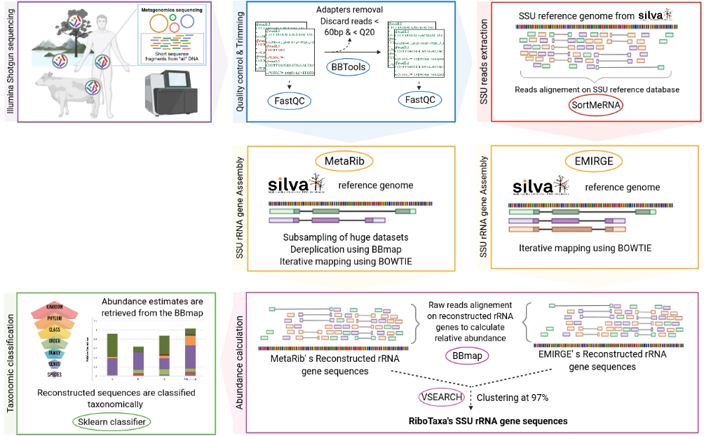

# RiboTaxa v1.4

by Oshma Chakoory, Sophie Marre, and Pierre Peyret.

RiboTaxa is a complete pipeline to rapidly filter and reconstruct the full length SSU rRNA gene from Illumina (meta)genomic dataset and perform taxonomic classification on the reconstructed sequences.

RiboTaxa takes as input paired end files which can be in compressed format (fastq.gz) or uncompressed format (.fastq).

Tools used in RiboTaxa pipeline:
- For quality control :<a class="reference external" href="http://www.bioinformatics.babraham.ac.uk/projects/fastqc/" target="_blank" rel="noopener noreferrer">FastQC</a>, <a class="reference external" href="https://multiqc.info/" target="_blank" rel="noopener noreferrer">MultiQC</a>
- For adapters removal and trimming: <a class="reference external" href="https://jgi.doe.gov/data-and-tools/bbtools/" target="_blank" rel="noopener noreferrer">BBTOOLS</a>
- To filter 16S/18S reads: <a class="reference external" href="https://academic.oup.com/bioinformatics/article/28/24/3211/246053" target="_blank" rel="noopener noreferrer">SortMeRNA</a> 
- To reconstruct full-length SSU rRNA sequences: <a class="reference external" href="https://genomebiology.biomedcentral.com/articles/10.1186/gb-2011-12-5-r44" target="_blank" rel="noopener noreferrer">EMIRGE</a>, <a class="reference external" href="https://pubmed.ncbi.nlm.nih.gov/32167532/" target="_blank" rel="noopener noreferrer">MetaRib</a> 
- Classify the full-length reconstructed SSU sequences: <a class="reference external" href="https://docs.qiime2.org/2020.8/plugins/available/feature-classifier/classify-sklearn/">sklearn classifier</a> of <a class="reference external" href="https://docs.qiime2.org/2020.8/" target="_blank" rel="noopener noreferrer">QIIME2</a>



## Quick-start

### Install Miniconda

Miniconda provides the conda environment and package manager, and is the recommended way to install RiboTaxa. Follow the <a class="reference external" href="https://conda.io/projects/conda/en/latest/user-guide/install/index.html" target="_blank" rel="noopener noreferrer">Miniconda instructions</a> for downloading and installing Miniconda. It is important to follow all of the directions provided in the <a class="reference external" href="https://conda.io/projects/conda/en/latest/user-guide/install/index.html" target="_blank" rel="noopener noreferrer">Miniconda instructions</a>, particularly ensuring that you run the following commands at the end of the installation process, to ensure that your Miniconda installation is fully installed and configured correctly:

```bash
conda config --add channels defaults
conda config --add channels bioconda
conda config --add channels conda-forge

conda init --all
```

### Updating Miniconda

After installing Miniconda and opening a new terminal, make sure you’re running the latest version of conda:

```bash
conda update conda
```

### Install RiboTaxa within a conda environment

Once you have Miniconda installed, run the following command to create the required conda environments for RiboTaxa. Creating a virtual environment is recommended to avoid conflicts between required dependencies and those in existing environment. 

```bash
git clone https://github.com/oschakoory/RiboTaxa.git
cd RiboTaxa
bash conda_virt_env.sh
```
The first virtual environment ```RiboTaxa_py27``` uses python 2.7 and contains all the necessary tools for quality control, to filter 16S18S reads and reconstruct full length rRNAs sequences.

The second virtual environment ```RiboTaxa_py36``` uses python 3.6 and runs sklearn classifier of QIIME2 to taxonomically classify full length reconstruted rRNAs sequences.

### Activate the conda environment

Activation of virtual environment is done automatically in scripts. No need to activate environment manually, unless you want to scrutinize each tool used in RiboTaxa.

```bash
conda activate RiboTaxa_py27
conda list

emirge_amplicon.py --help
```
```bash
conda activate RiboTaxa_py36
conda list
```

### Install usearch (if you do not have usearch in your $path)

USEARCH is a unique sequence analysis tool which offers search and clustering algorithms that are often orders of magnitude faster than BLAST. To reconstruct full length rRNA sequences, ```EMIRGE``` uses ```USEARCH```. 

Please ensure that you have ```USEARCH``` installed in your ```$PATH``` using the following command:

```bash
usearch --version
echo $PATH
```

If not, please follow the <a class="reference external" href="https://pbertinblog.wordpress.com/usearch-installation/" target="_blank" rel="noopener noreferrer">usearch-installation instructions</a> to download ```USEARCH``` and install it in your ```$PATH```.

To make sure that usearch is successfully installed, run

```bash
usearch --version
```

Now, you are ready to use RiboTaxa !!!

## Let the power of RiboTaxa begin...

### Indexing databases

RiboTaxa pipeline includes tools like sortmerna and emirge, both of which need indexed databases of their own. The latest SILVA SSU 138.1 
can be downloaded <a class="reference external" href="https://www.arb-silva.de/" target="_blank" rel="noopener noreferrer">here</a>.

To index your database, you will need to fill the config file ```indexDB_arguments.conf```.If you are not sure of certains parameters, leave as defined except for directories and input files.

```bash
The configuration file is very important and each parameter needs to be filled to avoid errors.

script used: indexDB_RiboTaxa.sh

[Setting up directories...]

####set up RiboTaxa directory path
RiboTaxa_DIR = /home/user/Documents/RiboTaxa

[Setting up database path...]

####set up database path+database file in fasta format
DB_DIR = /home/user/Documents/Databases/SILVA_138_SSURef_Nr99_tax_silva.fasta

#### Set up output directory
OUTPUT = /home/user/Documents/Databases

#### set up the number of threads/CPUs to be used for indexing
THREAD = 8

#### set up the clustering id threshold (between 0.7-1)
CLUSTER_ID = 0.97
```

Once it is filled with all the necessary information, you can run the following command and index your database

```bash
bash -i indexDB_RiboTaxa.sh PATH_TO/indexDB_arguments.conf
```

Indexing database takes a while. Using the maximum number of available threads/CPUs will save time. This step will produce two directories in your ```OUTPUT``` path:
- sortemerna_indexed_DB : containing indexed files for sortmeRNA
- bowtie_indexed_DB : containing indexed files by <a class="reference external" href="http://bowtie-bio.sourceforge.net/manual.shtml" target="_blank" rel="noopener noreferrer">Bowtie</a> to be used for EMIRGE and MetaRib

### Running RiboTaxa pipeline

RiboTaxa pipeline will 
- Remove adapters and trim (meta)genomics data using <a class="reference external" href="https://jgi.doe.gov/data-and-tools/bbtools/" target="_blank" rel="noopener noreferrer">BBTOOLS</a>
- Filter 16S/18S reads using <a class="reference external" href="https://academic.oup.com/bioinformatics/article/28/24/3211/246053" target="_blank" rel="noopener noreferrer">SortMeRNA</a> 
- Reconstruct full-length SSU rRNA sequences using <a class="reference external" href="https://genomebiology.biomedcentral.com/articles/10.1186/gb-2011-12-5-r44" target="_blank" rel="noopener noreferrer">EMIRGE</a> 
- Classify the full-length reconstructed SSU sequences using <a class="reference external" href="https://docs.qiime2.org/2020.8/plugins/available/feature-classifier/classify-sklearn/">sklearn classifier</a> of <a class="reference external" href="https://docs.qiime2.org/2020.8/" target="_blank" rel="noopener noreferrer">QIIME2</a>


RiboTaxa can used for one paired-end dataset or multiple paired-end datasets in the same folder.

To run RiboTaxa, you will need to fill the config file ```RiboTaxa_arguments.conf```. If you are not sure of certains parameters, leave as defined except for directories and input files.

```bash
The configuration file is very important and each parameter needs to be filled to avoid errors.

[Setting up directories...]

####set up RiboTaxa directory
RiboTaxa_DIR = /home/user/Documents/RiboTaxa

####set up data directory containing only raw reads in fastq/fastq.gz format
###paired end read should be _R1.fastq and _R2.fastq
DATA_DIR = /home/user/Documents/MetaGenomics/raw_data

####set up output directory
OUTPUT = /home/user/Documents/MetaGenomics/results

####format of your paired end files 
## fastq : if files are not compressed
## fastq.gz: if files are compressed in gz format
FORMAT = fastq

[Quality control uing BBTOOLS]

####Trim reads to remove bases matching reference kmers
# f (don't trim)
# r (trim to the right)
# l (trim to the left)

ktrim = r

####Kmer length used for finding contaminants
kmer = 21

####Reads shorter than this after trimming will be discarded
minlength = 60

#Regions with average quality BELOW this will be trimmed
trimq = 10

####Trim read ends to remove bases with quality below trimq
# rl (trim both ends), 
# f (neither end), 
# r (right end only), 
# l (left end only),
# w (sliding window)

qtrim = rl

####reads with more Ns than this (after trimming) will be discarded
maxns = 1


[Filter 16S/18S reads using SortmeRNA]
####indexed database directory for sortmerna indexed files
SORTMERNA_DB = /home/user/Documents/Databases/sortmerna_indexed_silva_138

####number of threads/CPUS to be used through the pipeline
THREAD = 8


[Reconstructing 16S/18S sequences uisng EMIRGE and MetaRib]

[EMIRGE]
####indexed database diretory for emirge indexed file
EMIRGE_DB = /home/user/Documents/Databases/bowtie_indexed_silva_138_for_emirge

####length of longest reads 
MAX_LENGTH = 300

####identity (Value between 0.8 - 1)
IDENTITY = 0.97 

####number of iterations (Default value = 40)
NUM_ITERATION = 40

####mean insert size
MEAN_INSERT_SIZE = 300 

####standard deviation
STD_DEV = 100 

[METARIB]
##number of subsampling (reads) to be used by MetaRib at each iteration
SAMPLING_NUM = 1000000

[Taxonomic classfication using sklearn_classifier of qiime2]

####set up database directory and name for sklearn classifier
SKLEARN_DB = /home/user/Documents/RiboTaxa/silva-138-99-nb-classifier.qza

#Confidence threshold for limiting taxonomic depth (default = 0.7)
CONFIDENCE = 0.7

#Number of reads to process in each batch (default = 0)
BATCH = 1
```

For the taxonomic classification by sklearn classifier, the database used is the trained classifier ```SILVA 138 reference sequence``` downloaded from the <a class="reference external" href="https://docs.qiime2.org/2020.8/data-resources/" target="_blank" rel="noopener noreferrer">Data resources</a> of <a class="reference external" href="https://docs.qiime2.org/2020.8/" target="_blank" rel="noopener noreferrer">Qiime2</a>. To use other databases such as Greengenes or UNITE, you can download already trained classifer or train your own database by following the <a class="reference external" href="https://docs.qiime2.org/2020.8/data-resources/" target="_blank" rel="noopener noreferrer">Data resources</a> instructions.

Once it is filled with all the necessary information, you can use the following command to run the RiboTaxa pipeline

```bash
bash -i Pipeline_RiboTaxa.sh PATH_TO/RiboTaxa_arguments.conf
```

RiboTaxa produces the 4 following directories in your OUTPUT path of your ```RiboTaxa_arguments.conf``` file:
- ```quality_control``` : This directory contains your (meta)genomics (paired-end) files after adpaters removal and trimming. It also has two sub_directories ```before_fastqc``` and ```after_fastqc``` containing quality reports of your sequence files before and after trimming. You may look at the ```.html``` files in each sub-directory to have an overview of each (meta)genomics file or look into ```multiqc``` folder to have an overview of all the (meta)genomics files given to this pipeline.

- ```output_sortmerna``` : This folder contains filtered 16S/18S sequences from your trimmed (meta)genomics sequence files: ```$FILE_R1_16S18Sreads.fastq```,```$FILE_R2_16S18Sreads.fastq``` and  and a ```$FILE.log``` indicating the % of 16S/18S reads filtered from your (meta)genomics dataset. Reads not matching the SSU database are saved in ```$FILE_other_than_16S18S.fastq```.

-  ```SSU_sequences``` : This folder contains two subfolders: ```output_emirge``` and ```output_metarib```. These subfolders contain iterations perfomed by EMIRGE and MetaRib to reconstruct full-length/nearly full-length rRNA 16S/18S gene sequences. 

The file ```$FILE_SSU_sequences.fasta``` contains the final full-length/nearly full-length rRNA 16S/18S gene sequences recontructed by EMIRGE and MetaRib.
	
- Taxonomy : This folder contains the taxonomic classification of the full-length SSU rRNA sequences reconstructed by EMIRGE. It takes ```$FILE_renamed_16S18S_recons.fasta``` as input, converts it to ```$FILE_renamed_16S18S_recons_qiime2.qza``` and returns the classification of each sequence as ```$FILE_renamed_16S18S_recons_qiime2_taxonomy.qza```. To calculate relative abundace of each reconstructed SSU sequence, BBmap is used to map short reads onto SSU sequence and the number of assigned reads per sequence is divided by the sum of all the assigned reads (and multiplied by 100). Relative abundance is thus expressed in %. To view the classification and relative abundance of each sequence, open ```$FILE_SSU_taxonomy_abundance.tsv```.

. The ```$FILE_SSU_taxonomy_abundance.tsv``` contains the following column names:

```bash
Sequence_ID		Domain		Phylum			Class			Order		Family		Genus			Species		Confidence 	Length(bp)	Assigned reads		Relative_Abundance(%)
3|EU334524.1.1558	Bacteria	Desulfobacterota	Desulfuromonadia	Geobacterales	Geobacteraceae	Trichlorobacter	Geobacter_lovleyi	0.999874566	1425	68	4.6687
```


